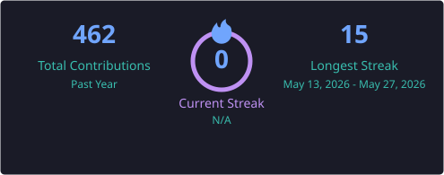

<div align="center">

```text
▄▄▄▄▄▄▄▄▄▄▄▄▄▄▄▄▄▄▄▄▄▄▄▄▄▄▄▄▄▄▄▄▄▄▄▄▄▄▄▄▄
█                                     █
█   ███╗   ██╗███████╗██╗  ██╗██╗   ██╗   █
█   ████╗  ██║██╔════╝╚██╗██╔╝██║   ██║   █
█   ██╔██╗ ██║█████╗   ╚███╔╝ ██║   ██║   █
█   ██║╚██╗██║██╔══╝   ██╔██╗ ██║   ██║   █
█   ██║ ╚████║███████╗██╔╝ ██╗╚██████╔╝   █
█   ╚═╝  ╚═══╝╚══════╝╚═╝  ╚═╝ ╚═════╝    █
█                                     █
▀▀▀▀▀▀▀▀▀▀▀▀▀▀▀▀▀▀▀▀▀▀▀▀▀▀▀▀▀▀▀▀▀▀▀▀▀▀▀▀▀
```

### [sudo] run developer_profile.sh

```bash
$ ./whoami
```

---

</div>

## 🧰 Tech Stack

<div align="center">

### 🎯 Languages


### 🖥️ Frontend


### ⚙️ Backend


### 🗄️ Database & Tools


</div>

---

## 📊 GitHub Analytics

<div align="center">






</div>

---

<div align="center">

### 💻 Terminal Quote

```text
"The code you write today is the legacy you leave tomorrow."
```

---

### 📫 Get In Touch

[](mailto:841958335@qq.com)
[](https://discord.com/users/alphafoxz)

---

```bash
$ exit
logout
```

</div>

<div align="center">

**⭐ Star this repo if you find it interesting!**

</div>
